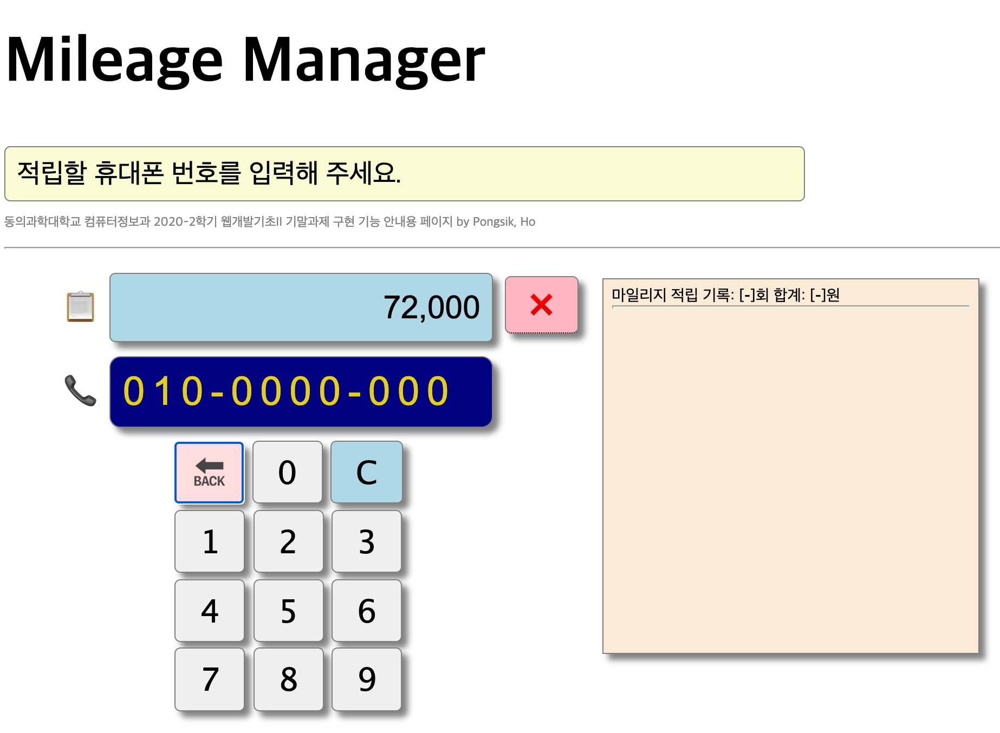

# Mileage Manager
## 개요
- 구입 금액을 휴대폰 번호별로 적립하는 SPA(Single Page App) 프로그램
- 마일리지 적립, 관리 기능에 한정하여 구현하였기 때문에 구입 금액 설정은 임의로 설정함
- 마일리지 정보는 서버의 DB가 아닌 웹 저장소(localStorage)에 저장함
  - 구입 금액을 입력할 수 있도록 수정하면 소규모 영업용으로 간단하게 활용 가능

#### Screeen Shot

## 특징
- 구입 금액 가져오기, 적립할 휴대폰 번호 입력, 번호 수정, 저장, 적립 취소 등의 동작에 필요한 버튼만 화면에 표시함.
- 오동작을 할 수 있는 가능성을 최소화 하도록 구현함
## 사용법
1. 구입금액 가져오기 ([V]버튼 선택: 금액은 1,000~10,000원 범위의 임의의 금액(천원 단위)로 설정됨)
2. 적립할 휴대폰 번호 입력
3. 휴대폰 번호 입력이 완성되면 (010-XXXX-YYYY), 입력된 번호의 적립 이력이 자동으로 표시됨.
   1. 표시된 이력은 입력 번호를 변경하면 내용이 삭제됨.
   2. [저장] 또는 [적립취소]를 선택하면 자동으로 사라짐.
4. [저장] 또는 [적립취소] 버튼을 선택
5. [저장] 또는 [적립취소]를 선택하기 전에 번호는 [X], [C]를 이용하여 다른 번호로 수정 입력 가능
6. 앱 타이틀 Milegage Manager를 선택하면 적립 현황을 표시함
   1. 표시된 화면을 클릭하면 사라짐
### 참고
- 이 앱은 2020년 2학기 웹개발기초II 기말과제 본보기로 구현한 것임
#### 동의과학대학교 컴퓨터정보과 허봉식
